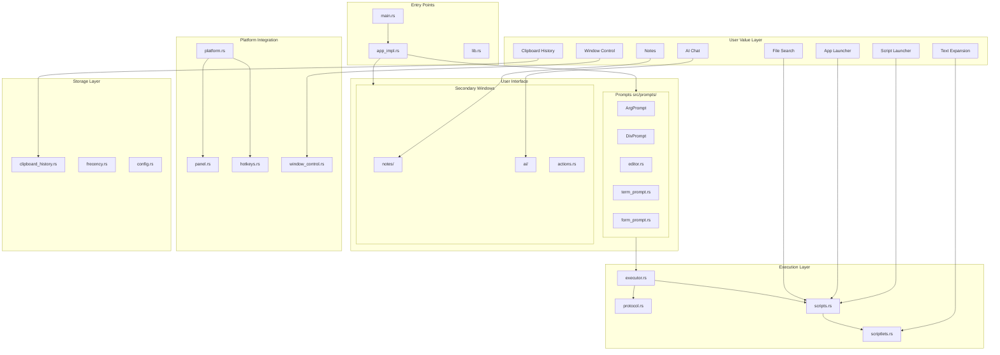
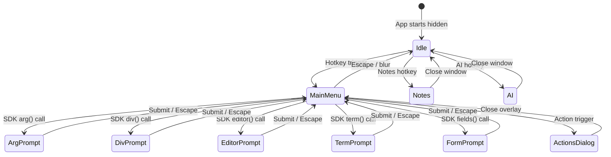
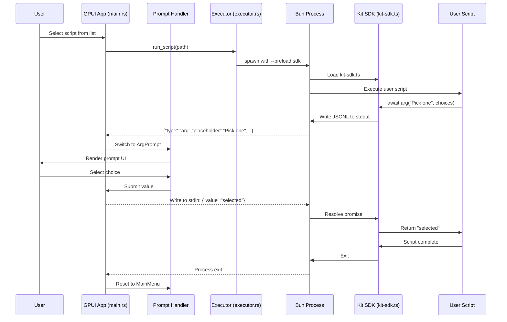

# System Diagrams

Visual maps of how code modules connect. Use to understand impact before making changes.

## Architecture Overview

Module dependencies and data flow from user features to storage.

## Application State Machine

Valid states and transitions. Escape/submit usually returns to MainMenu.

## Script Execution Flow

JSONL protocol between Rust app and Bun/SDK.

## Change Impact Guide

| If changing... | Check diagram | Look for... |
|----------------|---------------|-------------|
| Any module | Architecture | Upstream/downstream dependencies |
| State handling | State Machine | Which transitions are affected |
| Protocol messages | Execution Flow | All actors that parse that message type |
| Prompt rendering | Architecture + State | Both the UI module and valid states |
| SDK functions | Execution Flow | The full request/response cycle |

**Quick impact assessment:**
1. Find your module in Architecture diagram
2. Trace arrows IN (what depends on you) and OUT (what you depend on)
3. For state changes, verify transitions remain valid
4. For protocol changes, update both Rust and TypeScript sides
5. Run tests for all affected modules: `cargo test <module_name>`
