# Script Kit GPUI - User Story Map

## High-Level Feature Map

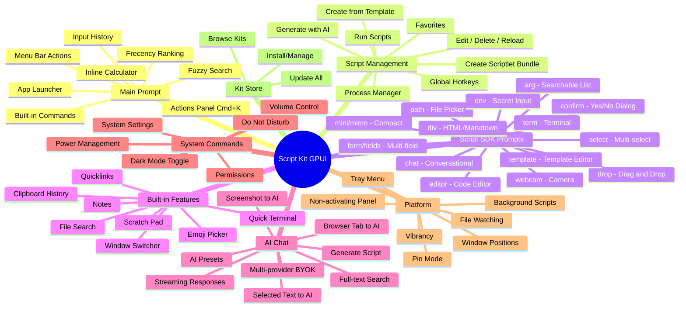

## User Journey: Main Prompt Flow

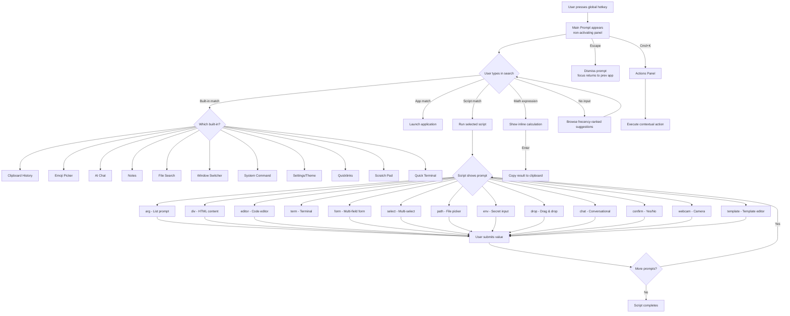

## AI Chat User Journey

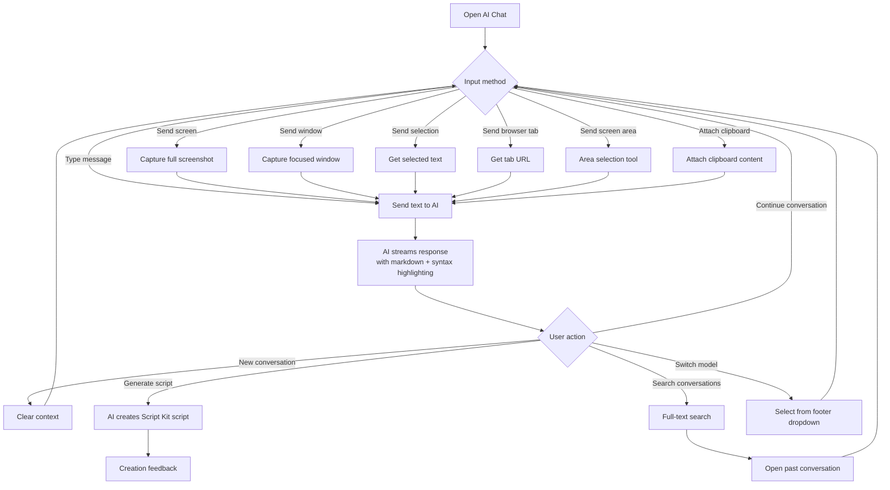

## Script SDK Protocol Flow

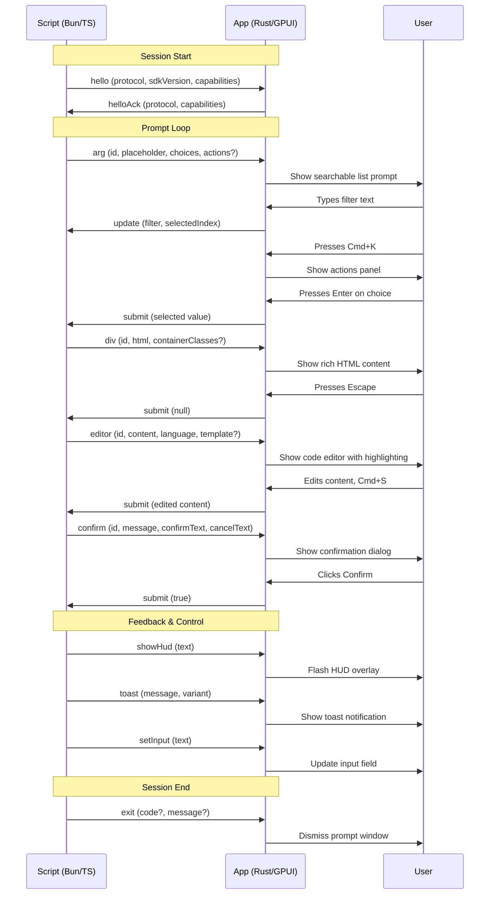

## Built-in Features Architecture

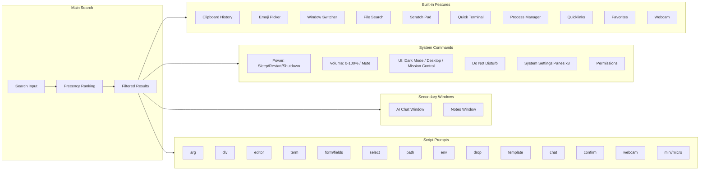

## Clipboard History Flow

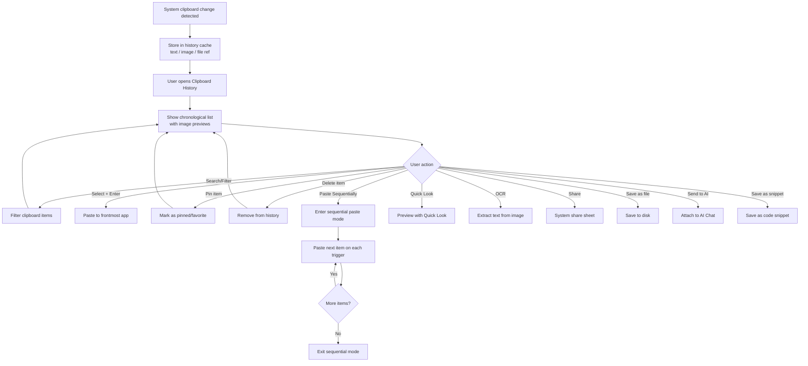

## Notes Feature Flow

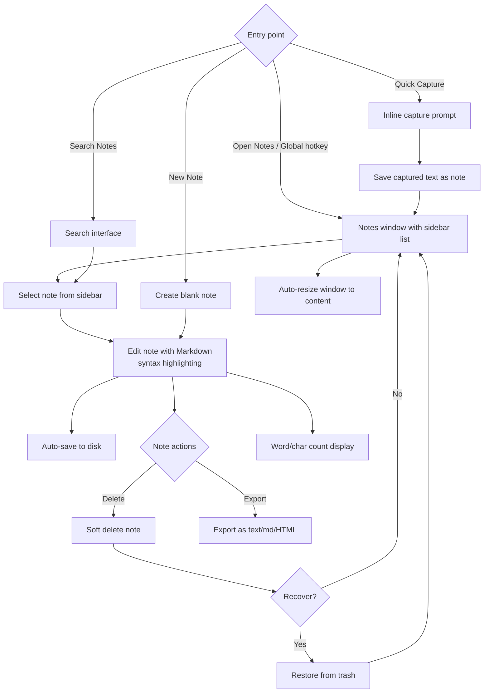

## Platform & Window Architecture

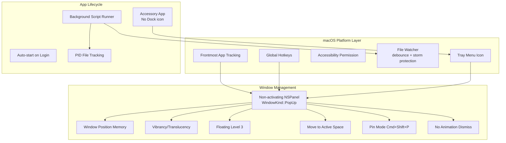

## Script Creation Flow

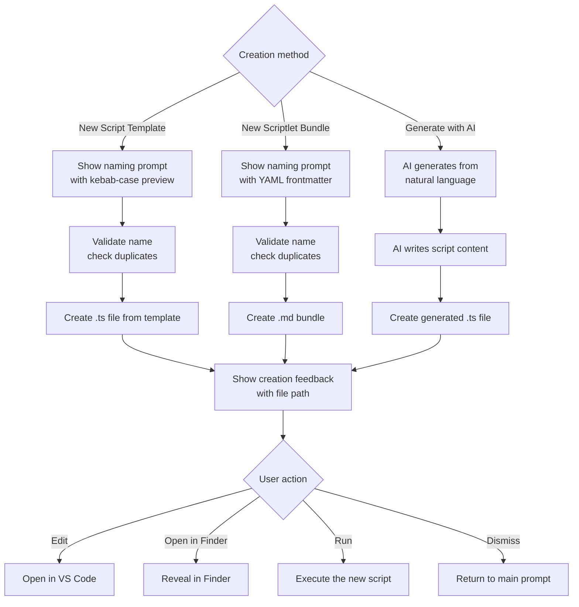

## Hotkeys & Shortcuts Architecture

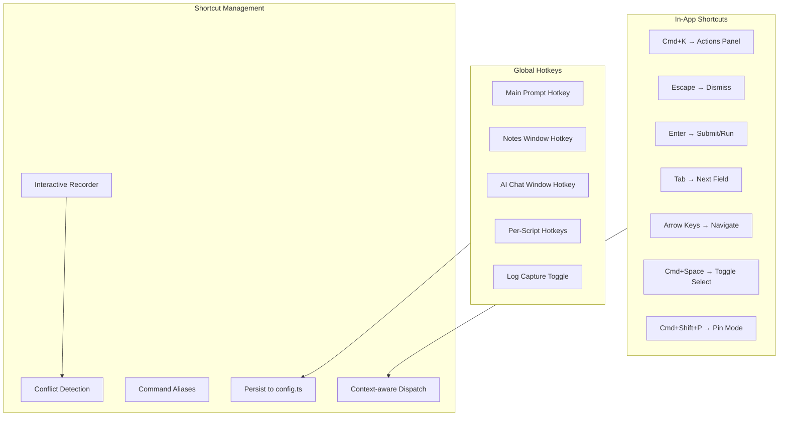

## Configuration & Settings

```mermaid
flowchart TD
    subgraph Config["User Configuration"]
        BC[Built-in Config<br>enable/disable features]
        API[API Keys<br>Vercel / OpenAI / Anthropic]
        TH[Theme Selection<br>with live preview]
        WP[Window Positions<br>reset to defaults]
        FR[Frecency Data<br>clear suggested]
        HK[Hotkey Mappings<br>interactive recorder]
        LY[Layout Settings<br>padding / scale / fonts]
    end

    subgraph BuiltInConfig["Feature Toggles"]
        BC --> CH_ON[Clipboard History]
        BC --> WS_ON[Window Switcher]
        BC --> AL_ON[App Launcher]
    end

    subgraph APIConfig["AI Provider Config"]
        API --> VK[Vercel AI Gateway Key]
        API --> OK[OpenAI API Key]
        API --> AK[Anthropic API Key]
    end

    subgraph ThemeConfig["Appearance"]
        TH --> TP[Browse + Search Themes]
        TH --> PREV[Live Preview]
        TH --> OPAC[Opacity Adjustment]
        TH --> DM[Dark Mode Toggle]
        TH --> CROSS[Cross-window Consistency]
    end

    subgraph Persistence["Persistence"]
        DISK[~/.scriptkit/kit/config.ts]
        KEYS[System Keyring<br>encrypted secrets]
        POS[Window Position Store]
    end

    Config --> DISK
    API --> KEYS
    WP --> POS
```

## External Automation API

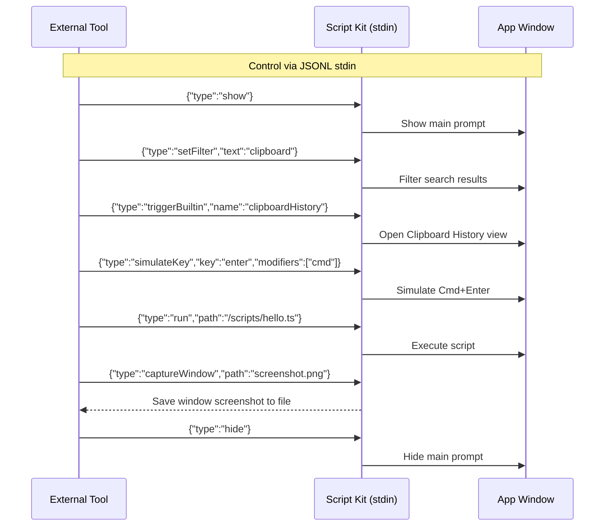

## Kit Store & Extensions

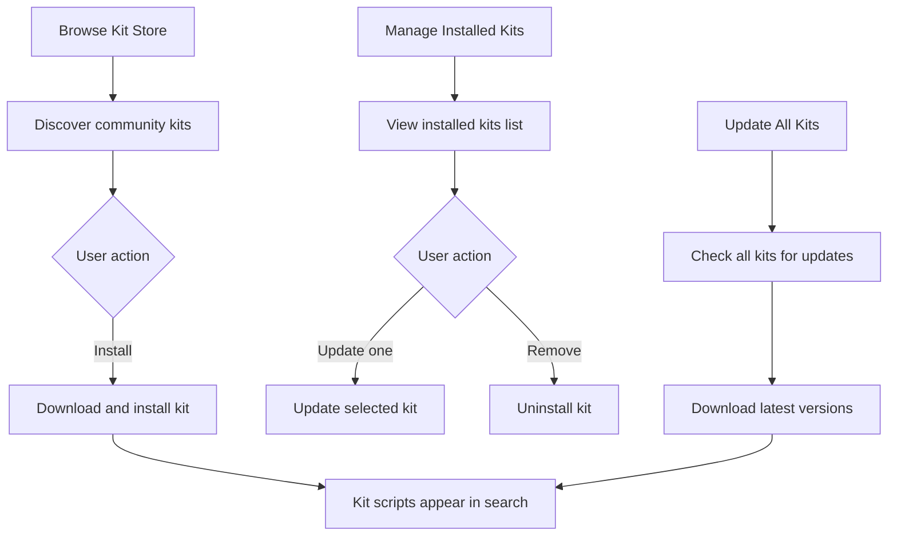
