# Notes New Note + Switcher Journey

**Type:** Sequence Diagram
**Last Updated:** 2026-01-02
**Related Files:**
- `src/notes/window.rs`
- `src/notes/actions_panel.rs`
- `src/notes/browse_panel.rs`
- `src/notes/storage.rs`
- `src/main.rs`
- `src/hotkeys.rs`

## Purpose

Show the step-by-step user journey for creating a new note and switching notes in the same window, including error handling and recovery.

## Diagram

```mermaid
sequenceDiagram
    actor User
    participant Window as Notes Window (Front-Stage)
    participant App as NotesApp (Back-Stage)
    participant Browse as BrowsePanel (Front-Stage)
    participant Storage as Notes Storage (Back-Stage)

    User->>Window: Press Notes hotkey
    Note over Window: Window focuses ⚡ immediate access
    Window->>App: open_notes_window()
    Note over App: Singleton handle 🛡️ prevents duplicates

    User->>Window: Cmd+N / New Note
    Window->>App: handle_action(NewNote)
    Note over App: create_note() 🎯 new note context
    App->>Storage: save_note(Note::new)
    Note over Storage: Persist note 💾 avoids data loss
    Storage-->>App: ok
    App-->>Window: select_note + editor_state update
    Note over Window: Editor cleared ✅ blank slate

    User->>Window: Cmd+P
    Window->>App: open_browse_panel
    App->>Browse: render + focus search
    Note over Browse: Focused search ⏱️ keeps flow fast
    User->>Browse: type query
    Browse->>App: on_select(note_id)
    App-->>Window: select_note + close panel
    Note over Window: Note swapped ⚡ no new window

    alt Save error
        Storage-->>App: error
        App-->>Window: show error + keep current note 🔄
    end

    alt Search error
        Browse-->>Window: show full list fallback 🔄
    end
```

## Key Insights

- **Single-window continuity:** The window remains focused and reused for both creation and switching.
- **Fast feedback:** UI focus and editor updates keep the flow immediate for users.
- **Recoverable failures:** Errors surface in the UI without losing the current note.

## Change History

- **2026-01-02:** Initial creation
