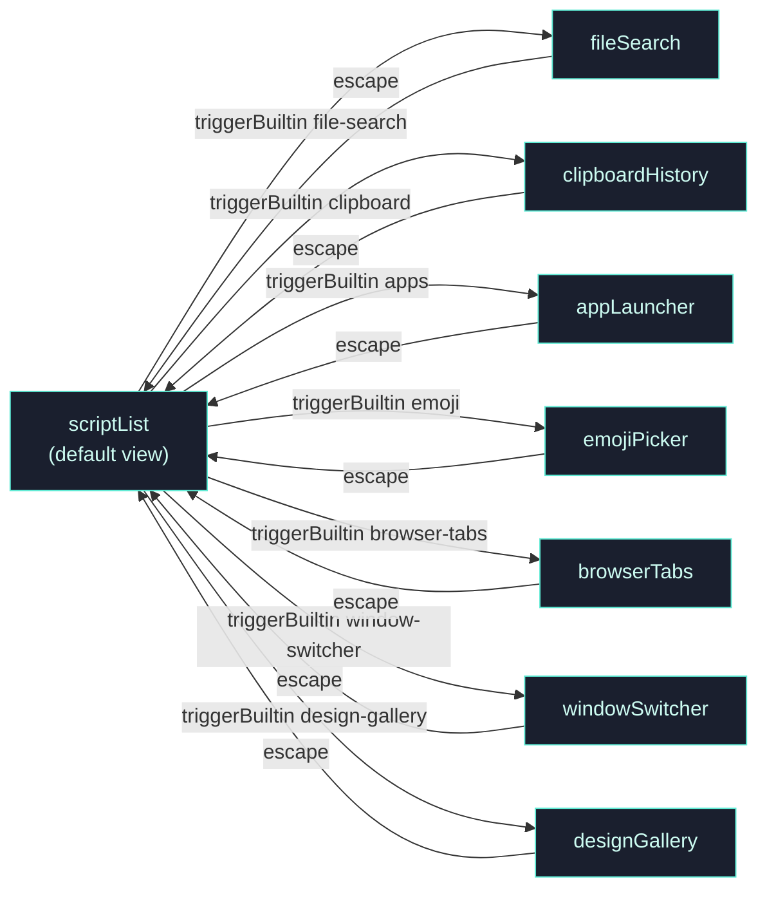

# Main Launcher — Drill-Down

Zoom into the main NSPanel and the seven subviews it hosts, showing how `triggerBuiltin` transitions re-key the active `AppView` and which audit stories verified each edge.

See [overview.md](./overview.md) for the top-level map and [README.md](./README.md) for the format.

## Subview transitions

## Stories anchored to each subview

```mermaid
flowchart TB
  classDef pass fill:#103820,stroke:#0f6,color:#f0fdf4
  classDef gap fill:#3a2a00,stroke:#fb7,color:#fef3c7
  classDef pending fill:#1e2030,stroke:#667,color:#d1d5db

  subgraph S_ScriptList["scriptList"]
    direction TB
    S1["main-menu-filter ✅"]:::pass
    S2["main-menu-empty-filter-results ✅"]:::pass
    S3["rapid-filter-convergence ✅"]:::pass
    S4["long-input-viewport-stability ✅"]:::pass
    S5["scriptlet-params-prompt-chain ✅"]:::pass
    S6["main-menu-cmd-enter-ai ✅"]:::pass
  end

  subgraph S_FileSearch["fileSearch"]
    direction TB
    F1["file-search-render ✅"]:::pass
    F2["file-search-open-action ✅"]:::pass
    F3["tool-filesearchview-simulatekey ✅"]:::pass
  end

  subgraph S_Clipboard["clipboardHistory"]
    direction TB
    C1["clipboard-history ✅"]:::pass
    C2["empty-clipboard-state ⚠️"]:::gap
    C3["clipboard-to-acp-paste ⚠️"]:::gap
  end

  subgraph S_Apps["appLauncher"]
    direction TB
    A1["apps-launcher ✅"]:::pass
  end

  subgraph S_Emoji["emojiPicker"]
    direction TB
    E1["emoji-picker ✅"]:::pass
  end

  subgraph S_DG["designGallery"]
    direction TB
    DG1["tool-design-gallery-triggerbuiltin ✅"]:::pass
  end

  subgraph S_WS["windowSwitcher"]
    direction TB
    WS1["tool-window-switcher-triggerbuiltin ✅"]:::pass
  end

  subgraph S_Cross["cross-subview (transitions + lifecycle)"]
    direction TB
    X1["builtin-open-close-churn ✅"]:::pass
    X2["window-visibility-flap-stability ✅"]:::pass
    X3["automation-semantic-surface-reflects-active-appview ✅"]:::pass
    X4["view-transition-mid-mutation ✅"]:::pass
    X5["tool-hide-rpc-surface-reset ✅"]:::pass
  end
```

## Key invariants proven

- **Subview re-keys the automation channel**: every transition from `scriptList` to one of the seven subviews updates `AutomationWindowInfo.semanticSurface` in place via `update_automation_semantic_surface` (`automation-semantic-surface-reflects-active-appview`, Pass #19).
- **Single NSPanel throughout churn**: rapid-fire `triggerBuiltin` across five builtins in under 500ms keeps `listAutomationWindows.windows.len == 1` and converges to the final subview (`builtin-open-close-churn`, Pass #15).
- **Visibility lifecycle idempotent**: 10 alternating `show`/`hide` commands in 585ms leave no ghost panels and converge to the last-issued command within 200ms (`window-visibility-flap-stability`, Pass #18).
- **Hide resets surface to `scriptList`**: BOTH `hide_main_window_helper` AND the three stdin `ExternalCommand::Hide` arms (`runtime_stdin_match_core.rs`, `runtime_stdin.rs`, `app_run_setup.rs`) explicitly re-key via `update_automation_semantic_surface("main", Some("scriptList"))` after `reset_to_script_list` — so the next show starts from a clean tag. Closed by Pass #21 `tool-hide-rpc-surface-reset ✅`; the parity is CI-gated by `tests/hide_rpc_surface_reset_contract.rs`.
- **Filter convergence**: typing at up to keyboard speed against a non-trivial script list settles the list within one frame of the last keystroke; `rapid-filter-convergence` exercises this under stress.

## What is NOT yet covered

- `windowSwitcher` coverage gap CLOSED by Pass #22 `tool-window-switcher-triggerbuiltin ✅`: automation can now reach the subview via `triggerBuiltin window-switcher` / `windowswitcher` / `windows` across all three stdin dispatchers; cache loader wires the same `view.cached_windows` field the main-menu path uses so renderer behavior is identical regardless of entry point.
- `designGallery` coverage gap CLOSED by Pass #23 `tool-design-gallery-triggerbuiltin ✅`: the dispatcher arm already existed, but Pass #23 adds a 3-test source-level contract (`tests/design_gallery_triggerbuiltin_contract.rs`) pinning the arm invariants (`filter: String::new()`, `selected_index: 0`, `update_window_size_deferred`), the three aliases, and the `AppView::DesignGalleryView => "designGallery"` map entry. Live verification: `scriptList → designGallery → scriptList` with `choiceCount:85` and panel-resize receipts. Every subview reachable via `triggerBuiltin` now has both a dispatcher arm AND a verification story + contract test.
- `cmd+enter → AI` coverage gap CLOSED by Pass #24 `main-menu-cmd-enter-ai ✅`: both simulateKey dispatchers (`runtime_stdin_match_simulate_key.rs` + `app_run_setup.rs` embedded copy) now route `{type:"simulateKey", key:"enter", modifiers:["cmd"]}` through `try_route_global_cmd_enter_to_acp_context_capture`, the same helper invoked by the live GPUI keybinding at `src/render_script_list/mod.rs:881-885`. Stdin and live-keybinding paths share one routing decision. Live receipt: selection `"Theme Designer"` (scriptList index 0) arrived in ACP as `@cmd:"Theme Designer"` chip with `contextChipCount:1, contextReady:true`. Pinned by 3-test contract at `tests/simulate_key_cmd_enter_scriptlist_contract.rs`.
- Popup routing from main-hosted subviews (e.g. `fileSearch` + `Cmd+K`) is covered implicitly by `tool-actions-popup-enter` but has no dedicated subview-level story.
