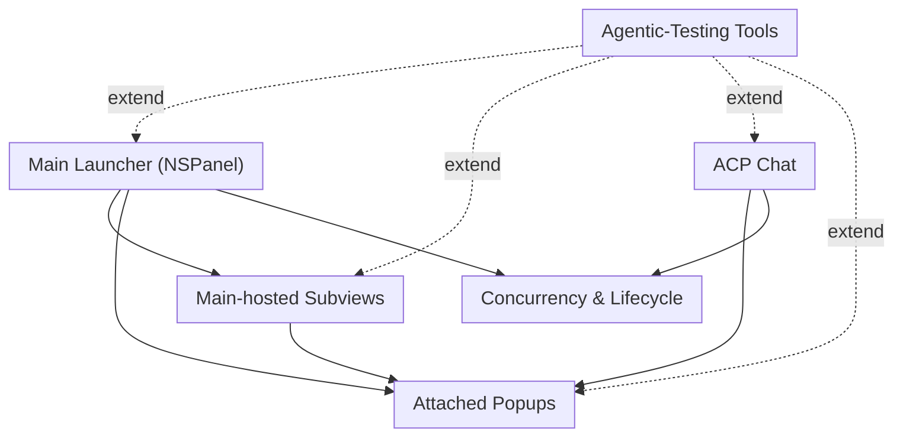

# AFK Audit — Surface Coverage Overview

Top-level map of Script Kit GPUI surfaces and the audit stories that prove their behavior. Each node names a story; status suffix reflects the newest pass outcome.

## Map

## Coverage stats (Run 2 through Pass #36)

## Edges worth noting
