# AFK Audit — Surface Coverage Overview

Top-level map of Script Kit GPUI surfaces and the audit stories that prove their behavior. Each node names a story; status suffix reflects the newest pass outcome.

See [README.md](./README.md) for the legend and format. Drill-down diagrams: [main-launcher.md](./main-launcher.md).

## Map

```mermaid
flowchart TB
  classDef pass fill:#103820,stroke:#0f6,color:#f0fdf4
  classDef gap fill:#3a2a00,stroke:#fb7,color:#fef3c7
  classDef pending fill:#1e2030,stroke:#667,color:#d1d5db
  classDef tool fill:#0c2340,stroke:#38bdf8,color:#e0f2fe

  subgraph Main["Main Launcher (NSPanel)"]
    direction TB
    MainFilter["main-menu-filter ✅"]:::pass
    MainEmpty["main-menu-empty-filter-results ✅"]:::pass
    RapidFilter["rapid-filter-convergence ✅"]:::pass
    LongInput["long-input-viewport-stability ✅"]:::pass
    ScriptletParams["scriptlet-params-prompt-chain ✅"]:::pass
    CmdEnter["main-menu-cmd-enter-ai ✅"]:::pass
    BuiltinChurn["builtin-open-close-churn ✅"]:::pass
    WindowFlap["window-visibility-flap-stability ✅"]:::pass
    SemanticSurface["automation-semantic-surface-reflects-active-appview ✅"]:::pass
    SemanticSurfaceSweep["automation-semantic-surface-full-dispatcher-sweep ✅"]:::pass
    AcpSurfaceTag["acp-surface-automation-tag ✅"]:::pass
    DirectFlipRekey["direct-subview-to-subview-trigger-surface-rekey ✅"]:::pass
    HidePathAsymmetry["hide-path-asymmetry-hotkey-vs-stdin-contract ✅"]:::pass
    DetachedPopupSurfaceParity["detached-popup-acp-surface-parity-contract ✅"]:::pass
    DetachedCloseCleanup["detached-popup-close-cleanup-contract ✅"]:::pass
    DetachedConcurrentCloseSafety["detached-popup-concurrent-close-safety ✅"]:::pass
    DetachedCloseLiveVerify["detached-popup-close-live-verify ✅"]:::pass
    DetachPathMainSurfaceRekey["detach-path-main-surface-rekey-contract ✅"]:::pass
    AcpReattachRegistryClean["acp-reattach-after-detach-registry-clean ✅"]:::pass
    TriggerBuiltinPostMatchRekey["trigger-builtin-post-match-surface-rekey-contract ✅"]:::pass
    TriggerBuiltinUnknownNameNoOp["trigger-builtin-unknown-name-preserves-surface-tag ✅"]:::pass
    TriggerBuiltinCaseInsensitive["trigger-builtin-case-insensitive-dispatch ✅"]:::pass
    TriggerBuiltinRepeatIdempotency["trigger-builtin-repeat-idempotency ✅"]:::pass
  end

  subgraph Subviews["Main-hosted Subviews"]
    direction TB
    FileSearch["file-search-render ✅"]:::pass
    FileSearchOpen["file-search-open-action ✅"]:::pass
    Clipboard["clipboard-history ✅"]:::pass
    ClipboardEmpty["empty-clipboard-state ⚠️"]:::gap
    ClipboardAcp["clipboard-to-acp-paste ✅"]:::pass
    ClipboardFilterMissLive["clipboard-history-filter-miss-visible-count-live ✅"]:::pass
    ClipboardGetElemsFilter["clipboard-history-getelements-filter-aware ✅"]:::pass
    FilterableSubviewsGetElems["filterable-subviews-getelements-filter-aware ✅"]:::pass
    WinSwitcherGetElemsLive["window-switcher-getelements-filter-aware-live ✅"]:::pass
    TriggerBuiltinPM["trigger-builtin-process-manager ✅"]:::tool
    TriggerBuiltinCAC["trigger-builtin-current-app-commands ✅"]:::tool
    Apps["apps-launcher ✅"]:::pass
    Emoji["emoji-picker ✅"]:::pass
    EmojiUpDownNav["emoji-picker-up-down-arrow-nav ✅"]:::pass
    WindowSwitcher["tool-window-switcher-triggerbuiltin ✅"]:::tool
    DesignGallery["tool-design-gallery-triggerbuiltin ✅"]:::tool
  end

  subgraph ACP["ACP Chat"]
    direction TB
    TabAiOpen["tab-ai-open ✅"]:::pass
    SlashOpen["slash-picker-open ✅"]:::pass
    SlashScript["slash-script-authoring ✅"]:::pass
    AtOpen["at-picker-open ✅"]:::pass
    AcpCancel["acp-cancel-midstream ✅"]:::pass
    AgentSwitch["acp-agent-switch-preserves-draft ✅"]:::pass
    OpenTwice["acp-open-twice-no-dupe ✅"]:::pass
    AgentChurn["rapid-agent-switch-churn ✅"]:::pass
    ConfigReload["config-reload-during-streaming ✅"]:::pass
    TelemetrySpans["telemetry-span-coverage ✅"]:::pass
    ScreenshotIdentity["screenshot-identity-threading ✅"]:::pass
    PortalDictation["portal-dictation-roundtrip ✅"]:::pass
    HistoryPortal["history-portal-query-seed ✅"]:::pass
    DetachRoundtrip["detached-acp-roundtrip ✅"]:::pass
    DetachReattach["detach-then-reattach-identity ✅"]:::pass
    NotesHosted["notes-hosted-acp-replaces-staging ✅"]:::pass
    AcpComposerPaste["acp-composer-paste-text-invariants ✅"]:::pass
  end

  subgraph Popups["Attached Popups"]
    direction TB
    ActionsDialog["actions-dialog-open ✅"]:::pass
    TargetMutation["actions-dialog-target-mutation ✅"]:::pass
  end

  subgraph Concurrency["Concurrency & Lifecycle"]
    direction TB
    BatchAtomic["batch-atomicity-under-concurrent ✅"]:::pass
    ViewTransition["view-transition-mid-mutation ✅"]:::pass
    SessionLeak["session-leak-probe ✅"]:::pass
  end

  subgraph Tools["Agentic-Testing Tools"]
    direction TB
    ToolActionsEnter["tool-actions-popup-enter ✅"]:::tool
    ToolTriggerAction["tool-trigger-action-command ✅"]:::tool
    ToolFileSearchKey["tool-filesearchview-simulatekey ✅"]:::tool
    ToolTableDriven["tool-table-driven-simulatekey ✅"]:::tool
    ToolGpuiRearm["tool-simulategpui-main-rearm ✅"]:::tool
    ToolPanelVis["tool-window-panel-visibility ✅"]:::tool
    ToolGpuiInterceptor["simulate-gpui-event-interceptor ✅"]:::pass
    ToolFocusDelta["native-input-focus-delta ✅"]:::pass
    ToolMermaid["tool-surface-coverage-mermaid-artifact ✅"]:::tool
    ToolHideReset["tool-hide-rpc-surface-reset ✅"]:::pass
    ToolTriggerActionAcpDetached["tool-trigger-action-acpdetached-host ✅"]:::tool
    ToolSimGpuiReacquire["tool-simulategpui-main-reacquire-contract ✅"]:::pass
    ToolPasteClipboardAcp["tool-paste-clipboard-into-acp-composer ✅"]:::tool
    ToolStateResultVisibleCount["tool-state-result-visible-choice-count-contract ✅"]:::pass
    StdinParseErrorRecovery["stdin-protocol-parse-error-recovery-contract ✅"]:::pass
  end

  Main --> Subviews
  Main --> Popups
  Subviews --> Popups
  ACP --> Popups
  ACP --> Concurrency
  Main --> Concurrency
  Tools -.->|"extend"| Main
  Tools -.->|"extend"| Subviews
  Tools -.->|"extend"| ACP
  Tools -.->|"extend"| Popups
```

## Coverage stats (Run 2 through Pass #36)

- **✅ pass**: 66 stories across six surface families (Pass #56 shipped `stdin-protocol-parse-error-recovery-contract` — live-verified on dev-watch pid 38095 that the stdin listener loop at `src/stdin_commands/mod.rs#start_stdin_listener` survives 3 distinct malformed-payload shapes and continues to dispatch subsequent valid commands: `{"malformed":"..."}` (missing field `type`) → `stdin_parse_failed` logged, loop continues; plain text `this is not even json at all` (expected ident) → `stdin_parse_failed`, loop continues; `{"type":"unknownCommandType",...}` (unknown variant) → `stdin_parse_failed`, loop continues; then a valid `listAutomationWindows` parsed + dispatched + returned `windows.length==1 main/scriptList`. The listener is THE single-threaded choke point through which every automation command reaches the app — a silent severance (one `break`, `return`, or `panic!` in the parse-error or oversized-line arm) would turn every subsequent `session.sh send` into a no-op while the forwarder still reports success. 3-test structural contract at `tests/stdin_parse_error_recovery_contract.rs` (3/3 pass in 0.00s after 2.89s compile) pins three invariants: (1) the parse-error arm body contains `stdin_parse_failed` AND NONE of `break/return/panic!(/unreachable!(/todo!(`; (2) the `Ok(StdinLineRead::TooLong { raw, raw_len })` arm body contains `stdin_command_too_large` AND NONE of the same forbidden control-flow tokens — oversized script payloads must not brick the listener; (3) counter-positive — the OUTER `Err(e) => { tracing::error!("stdin_read_error", …); break; }` arm DOES contain `break;` within 400 bytes of its anchor, because busy-spinning on EOF/broken-pipe would re-emit the same error forever. The `too_long_arm_body` helper is intentionally split (anchor-then-`=> {`-scan, not `balanced_block_body` directly) to skip past the destructure pattern's opening brace inside `{ raw, raw_len }` — an initial first-draft bug caught by running tests before committing. No production code edited. Coverage 65 → 66.) Pass #55 shipped `trigger-builtin-repeat-idempotency` — live-verified on dev-watch pid 38095 that repeat invocations of the same `triggerBuiltin` name produce IDENTICAL view + automation-registry state: `triggerBuiltin tab-ai` ×2 back-to-back → both calls yield 1 main window `semanticSurface:"acpChat"` with identical bounds; `triggerBuiltin clipboard-history` ×2 → both yield `promptType:"clipboardHistory"` + `choiceCount:100`; `triggerBuiltin emoji` ×3 rapid-fire (200 ms apart) → still exactly 1 main window `semanticSurface:"emojiPicker"`. Repeat-idempotency is structural: arm bodies perform only pure field overwrites on `view` (no Vec pushes, no registry upserts, no conditional skip-guards), and Pass #52's post-match re-key is already pure-overwrite. 3-test structural contract at `tests/trigger_builtin_repeat_idempotency_contract.rs` (3/3 pass in 0.00s after 17.14s compile): (1) no arm body directly calls `upsert_automation_window(` or `remove_automation_window(` — registry lifecycle flows through view-state transitions, not per-trigger side effects; (2) defense-in-depth — forbids `.push(` / `.insert(` co-located with `automation_windows` within a 100-byte window; (3) arm-body `view.current_view =` assignments are unconditional (no `view.current_view !=`/`==` guard within 120 preceding bytes). Uses a brace-counted `trigger_builtin_arm_span(src, path)` helper to scope all checks to the `ExternalCommand::TriggerBuiltin { ref name } => { ... }` arm body, ignoring matches elsewhere. Completes the four-part TriggerBuiltin dispatcher cordon: arm-head symmetry (#42), post-match re-key unconditional (#52), catch-all no-op (#53), case-insensitive (#54), repeat-idempotent (#55). No production code edited. Coverage 64 → 65.) Pass #54 shipped `trigger-builtin-case-insensitive-dispatch` — live-verified on dev-watch pid 38095 that four pathological case-variant `triggerBuiltin` names route identically to their lowercase canonical form: `TAB-AI` → `acpChat`, `Clipboard-History` → `clipboardHistory`, `EMOJI` → `emojiPicker`, `fIlE-sEaRcH` → `fileSearch`; `hide` → `scriptList`. No `Unknown built-in:` logs fired during Steps 1–4 (proves the variants matched valid arms, not the catch-all). Case-insensitivity works because every dispatcher normalizes at a single choke point: `match name.to_lowercase().as_str() { ... }`. Source-level contract at `tests/trigger_builtin_case_insensitive_dispatch_contract.rs` (3 tests, 3/3 pass in 0.00s after 24.22s compile): (1) each dispatcher contains EXACTLY ONE `match name.to_lowercase().as_str() {` — pins the normalization choke point; (2) the case-sensitive alternative `match name.as_str() {` is forbidden inside each `ExternalCommand::TriggerBuiltin` arm body (first-8000-byte scope); (3) every canonical arm-head literal (10 patterns reused from Pass #42's `EXPECTED` table) is ASCII lowercase + hyphen + digit only — an uppercase character would be dead code since the matcher is fed `.to_lowercase()`. Pair with Passes #42/#52/#53 for the complete dispatcher cordon: arm heads symmetric (#42), matching is case-insensitive (#54), catch-all is no-op (#53), post-match re-key is unconditional (#52). No production code edited. Coverage 63 → 64.) Pass #53 shipped `trigger-builtin-unknown-name-preserves-surface-tag` — live-verified on dev-watch pid 38095 that firing `triggerBuiltin` with a name that matches none of the known-builtin arms is a strict no-op for view and surface tag. Sequence: `show + getState` baseline `scriptList`; `triggerBuiltin tab-ai` → `acpChat`; `triggerBuiltin definitely-not-a-real-builtin-xyz-123` → STILL `acpChat` (view + tag preserved); `triggerBuiltin clipboard-history` → `clipboardHistory` (choiceCount:100); `triggerBuiltin another-fake-builtin` → STILL `clipboardHistory` (dataset unpoisoned); `hide` → `scriptList` visible:false. Both unknown-name invocations produced the expected `Unknown built-in:` WARN log in app.log, proving the `_ =>` catch-all arm ACTUALLY fired — the surface preservation is due to the arm being a pure logging no-op (not due to the unknown name silently routing elsewhere). Paired source-level contract at `tests/trigger_builtin_unknown_name_no_op_contract.rs`: (1) exact-byte match of the canonical 36-space-indented `_ => { logging::log("ERROR", &format!("Unknown built-in: '{}'", name)); }` arm body across all three dispatchers; (2) structural span-scan between the `_ => {` opener and matching `}` rejects any `view.current_view =` assignment or `update_automation_semantic_surface` call inside — defense-in-depth against a future contributor who matches the arm shape but inserts state-mutating code. Tests 2/2 in 0.00s after 18.84s compile. Pair with Pass #52: #52 pins the post-match re-key is unconditional (positive invariant); #53 pins the `_ =>` arm is side-effect-free (negative invariant). Together, the two form a tight cordon around `ExternalCommand::TriggerBuiltin` — a refactor that silently added a view-mutation to the unknown-name arm would pass every existing contract while regressing user experience on every typo. No production code edited. Coverage 62 → 63.) Pass #52 shipped `trigger-builtin-post-match-surface-rekey-contract` — pinned the unconditional post-match `update_automation_semantic_surface("main", semantic_surface_for_main_view(&view.current_view))` call at the TAIL of `ExternalCommand::TriggerBuiltin` in all three stdin dispatchers (`runtime_stdin_match_core.rs`, `runtime_stdin.rs`, `app_run_setup.rs`). This is the choke point that reads `view.current_view` AFTER the inner trigger match flips it and writes the fresh surface tag — the runtime mechanism Pass #51's reattach round-trip composes, Pass #44's direct-subview-to-subview chain relies on, and Pass #42's per-arm symmetry contract presumes but does NOT pin. New 3-test contract at `tests/trigger_builtin_post_match_surface_rekey_contract.rs`: (a) every dispatcher contains the exact canonical multi-line call with `&view.current_view` dynamic lookup (not a pre-match snapshot), (b) every dispatcher contains the hide-path sibling with hardcoded `Some("scriptList".to_string())`, (c) the re-key appears AFTER the inner `match name.to_lowercase()` closing brace — structurally verified by finding the `Unknown built-in:` catch-all log line between the match head and the re-key position. A drive-by refactor moving the call inside an `if let` guard, or replacing `&view.current_view` with a stale pre-match snapshot, would pass Pass #42's symmetry contract while breaking Pass #51 and Pass #44 at runtime — this contract catches that. Documented in `lat.md/acp-chat.md` as `### Reattach re-keys main's automation surface via the triggerBuiltin choke point` subsection under `## Detached window behavior`. No production code change — pure source-level pin closing the final gap in the triggerBuiltin→surface-tag dispatch cordon. Coverage 61 → 62.) Pass #51 shipped `acp-reattach-after-detach-registry-clean` — pure dynamic-behavior verification that composes the ACP-detached-popup contracts from Passes #46/#47/#48/#50 into a single end-to-end round-trip: `show + triggerBuiltin tab-ai` → `triggerAction acp_detach_window host=main` → `triggerAction acp_close host=acpDetached` → `triggerBuiltin tab-ai` again (the reattach). At Step 4 the automation registry must hold exactly ONE window with `kind:"main"`, `semanticSurface:"acpChat"`, and NO lingering `acpDetached:*` ghost entry from the previous attach cycle. Required a dev-watch restart first: pid 94273 had been started before the final cargo build completed and rejected `triggerBuiltin` commands with `unknown variant`; autonomous `cargo build` (18.06s) + `session.sh stop && start` → fresh pid 38095. Live receipts — Step 1: 1 window `main/acpChat`, `getAcpState.resolvedTarget.windowKind:"main"`, `contextChipCount:1`; Step 2: 2 windows `main/scriptList` + `acpDetached:6101b56e-60b3-4c51-9d6d-b41fa982c4a3/acpChat` — Pass #50's detach-path re-key fix re-confirmed on fresh binary (main reports `scriptList`, not stale `acpChat`); Step 3: 1 window `main/scriptList`, detached drained; Step 4 (KEY): 1 window `main/kind:main/acpChat`, NO `acpDetached:*` entry, `getAcpState.resolvedTarget.windowKind:"main"`, `contextChipCount:1`, `inputText` preserved from Step 1 — thread state survives the full cycle; Step 5: `main/scriptList`, `windowVisible:false`. Four invariants confirmed at runtime: (a) registry exclusivity on reattach — no ghost `acpDetached:*` from prior cycle; (b) surface tag identity — `acpChat → scriptList → acpChat → scriptList` across 5 steps with no drift; (c) thread-state preservation across detach+close+reattach; (d) ACP target resolver re-binding — `resolvedTarget.windowKind` flips back to `"main"` after the cycle. Detached-popup lifecycle now pinned at BOTH source level (5 contract tests) AND runtime level (this round-trip). No production code edited — pure composition verification. Coverage 60 → 61.) Pass #50 shipped `detach-path-main-surface-rekey-contract` — fixed the drift Pass #49 observed. After `triggerAction acp_detach_window host=main`, main's view flipped back to ScriptList but `listAutomationWindows[0].semanticSurface` stayed stale `"acpChat"` until the next `hide`. Added a 5-line re-key block to `close_acp_chat_to_script_list` in `src/app_impl/tab_ai_mode.rs`: one `crate::windows::update_automation_semantic_surface("main", Some("scriptList".to_string()))` call inserted between `clear_transient_script_list_trigger_on_return(None, cx)` and the `acp_chat_restored_to_script_list` tracing emit, in lockstep with the `self.current_view = AppView::ScriptList` flip a few lines above. Mirrors the hide-path sibling at `src/main_sections/window_visibility.rs:397` which calls the same helper after `reset_to_script_list`. Live-verified after dev-watch restart (pid 89365 → 94273): `triggerAction acp_detach_window host=main` creates detached popup `acpDetached:d279bf09-e1c6-453b-918c-13e276d9f445` AND main immediately reports `listAutomationWindows[0].semanticSurface:"scriptList"` matching `getState.promptType:"none"` — drift eliminated at detach time, no wait-for-hide anymore. New 3-test contract at `tests/detach_path_main_surface_rekey_contract.rs` pins (a) the exact re-key call appears in `close_acp_chat_to_script_list`'s body, (b) re-key happens BEFORE the `acp_chat_restored_to_script_list` tracing event so race-sensitive observers see a consistent snapshot, (c) re-key happens AFTER `self.current_view = AppView::ScriptList;` so tag and view are always coherent. Documented in `lat.md/acp-chat.md` as `### Detach path re-keys main's automation surface to scriptList` under `## Detached window behavior`, cross-linking to the hide-path sibling. ACP-detached-popup lifecycle now has FIVE source-level pins: Pass #43 Main-hosted surface tag, Pass #46 creation, Pass #47 close cleanup pair, Pass #48 race-safe extraction, Pass #50 detach-path re-key. Coverage 59 → 60.) Pass #49 shipped `detached-popup-close-live-verify` — replayed Pass #29's live dispatch chain against dev-watch pid 89365 to prove the three-part static cordon (Pass #46 creation, Pass #47 cleanup pair, Pass #48 race-safe extraction) holds end-to-end in runtime dispatch. Receipts — baseline 1 window `scriptList` → `show + triggerBuiltin tab-ai` 1 window `acpChat` → `triggerAction acp_detach_window host=main` 2 windows including `acpDetached:fcaec17d-2b6c-4443-b296-6a87e7994a8b` → `triggerAction acp_close host=acpDetached` 1 window, detached removed cleanly → `hide` 1 window `scriptList`. app.log dispatch fingerprint confirmed: `TriggerAction host=AcpDetached` → `actions_host_execute` → `acp_actions_menu_selected host=detached` → `automation.runtime_handle_removed` → `Saved acp_chat bounds` → `detached_action_close` → `actions_host_execute_acp_detached dispatched=true`. Pass #47 cleanup-pair invariant verified in runtime (registry drained); Pass #48 race-safe extraction verified (exactly one `automation.runtime_handle_removed` event). Net-new drift observed — after detach but before hide, `listAutomationWindows[0].semanticSurface:"acpChat"` stays stale even though `getState.promptType:"none"` (main reverted to ScriptList via `event=acp_chat_restored_to_script_list`); re-keys to `"scriptList"` only on subsequent hide. Candidate follow-up `detach-path-main-surface-rekey-contract` queued. No production code change — pure live dispatch verification. Coverage 58 → 59.) Pass #48 shipped `detached-popup-concurrent-close-safety` — pinned the race-safe extraction pattern that makes the Pass #47 cleanup pair exactly-once. The detached popup has THREE cleanup sites against one `CHAT_WINDOW: OnceLock<Mutex<Option<ChatWindowState>>>` static — placeholder on_close, thread on_close, and the external `close_chat_window` helper — all locking the same Mutex. Rust-level mutual exclusion is guaranteed by the single Mutex, but the exactly-once functional guarantee (no double-run of the `remove_runtime_window_handle` + `remove_automation_window` pair on the same id) depends on every site using `slot.lock() + g.take()`: the winner of the race gets `Some(state)` and runs cleanup, the loser gets `None` and no-ops. A drive-by refactor replacing `.take()` with `.clone()` would silently break exactly-once. New 3-test contract at `tests/detached_acp_concurrent_close_safety_contract.rs` pins (a) `g.take()` appears ≥3 times, (b) `CHAT_WINDOW` static declared exactly once + `get_or_init` at ≥3 sites, (c) no clone-out-of-mutex patterns (` g.clone()`, ` g.as_ref().cloned()`, ` (*g).clone()` — whitespace-anchored to avoid false-positive on `dialog.clone()`). Documented in `lat.md/acp-chat.md` as `### Concurrent close safety — take-from-mutex pattern` subsection. ACP-detached-popup lifecycle now has FOUR source-level pins: Pass #43 Main-hosted surface tag, Pass #46 creation, Pass #47 close cleanup pair, Pass #48 race-safe extraction. Coverage 57 → 58.) Pass #47 shipped `detached-popup-close-cleanup-contract` — pinned Pass #29's registry-leak fix: the detached ACP popup has TWO close paths (user titlebar close routed through `on_window_should_close`; external callers via `close_chat_window(cx)`) and both MUST drain the `remove_runtime_window_handle(id)` + `remove_automation_window(id)` adjacent pair before `window.remove_window()`. Pass #29 added the duplication; Pass #47 pins it at source. New 2-test contract at `tests/detached_acp_close_cleanup_contract.rs`: one slices `close_chat_window` body and asserts the adjacent pair inside the automation-id guard appears before `window.remove_window();` with `save_window_from_gpui(WindowRole::AcpChat, ...)` persistence intact; the other scans the whole file for adjacent-pair sites (≥ 2) and confirms every `remove_automation_window(id)` has an adjacent `remove_runtime_window_handle(id)` partner. Documented in `lat.md/acp-chat.md` as `### Close cleanup — both paths drain the registry pair` under `## Detached window behavior`. No production code change — pure source-level pin, complementing Pass #46 (creation) and Pass #29 (dispatch). The ACP-detached-popup lifecycle is now fully contract-pinned across creation + dispatch + cleanup. Coverage 56 → 57.) Pass #46 shipped `detached-popup-acp-surface-parity-contract` — pinned the intentional kind+surface pair for detached ACP popups: the single production `upsert_automation_window` call in `src/ai/acp/chat_window.rs` registers the popup with `kind: AcpDetached` AND `semantic_surface: Some("acpChat")`, deliberately sharing the `"acpChat"` surface tag with the Main-hosted `AcpChatView` so consumers can filter on `semanticSurface == "acpChat"` regardless of attachment while using `kind` as the disambiguator. New 2-test contract at `tests/detached_acp_popup_registry_surface_contract.rs` asserts (a) the kind+surface pair inside the upsert struct literal, (b) exactly ONE `upsert_automation_window(` call + ONE `AutomationWindowKind::AcpDetached` mention in the whole file — preventing a second upsert site from forking the parity. Documented in `lat.md/acp-chat.md` as `### Automation registry parity — detached popup shares `acpChat` surface tag` under `## Detached window behavior`, enumerating the 4 automation test files that hardcode `Some("acpChat")` on `AcpDetached` fixtures. No production code change — pure source-level pin complementing Pass #43 (Main-hosted map entry) and Pass #45 (stdin-hide asymmetry guard). Coverage 55 → 56.) Pass #45 shipped `hide-path-asymmetry-hotkey-vs-stdin-contract` — pinned the intentional divergence between hotkey-toggle detach (chat persists, main stays visible on ScriptList) and stdin-hide reset (unconditional main hide + reset to scriptList). New 3-test contract at `tests/stdin_hide_no_acp_detach_branch_contract.rs` slices each dispatcher's `ExternalCommand::Hide` arm body between markers and asserts both positive half (reset + re-key present) AND negative half (no `open_chat_window_with_thread`, no `hotkey_detach_acp_*` tracing events, no `AppView::AcpChatView` branch). Documented the asymmetry in `lat.md/acp-chat.md` as `### Hide path asymmetry — hotkey detaches, stdin hides` subsection under `## Detached window behavior`. Behavior live-verified in Pass #44's probe on dev-watch pid 89365. Coverage 54 → 55.) Pass #44 shipped `direct-subview-to-subview-trigger-surface-rekey` — live-verified that direct-flip workflows chaining `triggerBuiltin A → triggerBuiltin B` without an intermediate `hide/show` re-key `listAutomationWindows[0].semanticSurface` cleanly on every transition. 10/10 green on dev-watch pid 89365: scriptList→acpChat→clipboardHistory→emojiPicker→fileSearch→browserTabs→windowSwitcher→processManager→currentAppCommands→designGallery→appLauncher, then final `hide`→scriptList. No source changes needed — the unconditional post-match `update_automation_semantic_surface` call means the re-key is pure-overwrite by construction, and Pass #42's `dispatcher_semantic_surface_symmetry_contract.rs` already pins the static structure. Pure dynamic-behavior verification pass. Coverage 53 → 54.) Pass #43 shipped `acp-surface-automation-tag` — closed the Main-hosted ACP automation-surface gap. Added `AppView::AcpChatView { .. } => "acpChat"` arm to `semantic_surface_for_main_view` at `src/main_sections/app_view_state.rs:273`; documented `acpChat` in `lat.md/automation.md:77` with a one-sentence scope clarification separating Main-hosted ACP from detached ACP popup-surface-class; extended `tests/dispatcher_semantic_surface_symmetry_contract.rs` `EXPECTED` table with the tab-ai triple so all three contract layers are pinned. Live-verified on dev-watch pid 89365 after binary restart: `triggerBuiltin tab-ai` → `getState.promptType="acpChat"` + `listAutomationWindows[0].semanticSurface="acpChat"`; `hide` → both reset to `scriptList`. Coverage: 52 → 53.) Pass #42 shipped `automation-semantic-surface-full-dispatcher-sweep` — promoted the per-arm semantic-surface verification to a full dispatcher sweep: 10/10 green live on dev-watch pid 29263 (9 triggers + hide reset), plus a 3-test forward safety net at `tests/dispatcher_semantic_surface_symmetry_contract.rs` that asserts (a) every canonical trigger-key arm head appears in all three stdin dispatchers, (b) `semantic_surface_for_main_view` maps every dispatcher flip target, (c) `lat.md/automation.md` lists every surface tag — the exact test that would have caught the Pass #40 + #41 latent bugs up front. No production code changes needed; pure verification pass. Tab-ai is a known exclusion — ACP-family, follow-up story `acp-surface-automation-tag` queued. Coverage: 51 → 52.) Pass #41 shipped `trigger-builtin-current-app-commands` — closed the remaining half of the Pass #39 tool gap. Added `current-app-commands`/`currentappcommands`/`current-app`/`app-commands`/`menu-commands` arms to all three stdin `triggerBuiltin` dispatchers; each arm delegates to the existing tray entry point `view.open_current_app_commands_from_tray(ctx)` so the identity-validated frontmost-app menu cache from `crate::frontmost_app_tracker` is preserved instead of bypassed with inline capture code, and errors log through `logging::log("ERROR", ...)` so the dispatcher loop survives a failed snapshot. Also fixed a sibling latent bug — `semantic_surface_for_main_view` was missing `CurrentAppCommandsView`, so the trigger would have flipped the view but left `listAutomationWindows` stuck at `scriptList`. Live-verified on dev-watch pid 29263: `promptType:"currentAppCommands"`, `choiceCount:98, visibleChoiceCount:98` from the `cmux` menu bar; filter miss → `visibleChoiceCount:0`, `getElements list:"0 items" totalCount:2`; clear → `list:"98 items"`, `"cmux → About cmux"` as first choice. 4-test contract at `tests/trigger_builtin_current_app_commands_contract.rs` pins the three dispatcher arms plus the semantic-surface arm. All four sibling filterable subviews — Apps/Windows/Processes/CurrentAppCommands — are now reachable via `triggerBuiltin` and live-verifiable, fully closing the Pass #39 tool gap.) Pass #40 shipped `trigger-builtin-process-manager` — added `process-manager`/`processmanager`/`processes` match arms to all three stdin `triggerBuiltin` dispatchers; live-verified `promptType:"processManager"` flip on dev-watch pid 77664; 3-test contract pins the dispatcher triplet at `tests/trigger_builtin_process_manager_contract.rs`; unblocks live-verification of the Pass #38 `ProcessManagerView` arm whenever scripts are running. `current-app-commands` split to its own story — requires async menu-bar fetch). Pass #39 shipped `window-switcher-getelements-filter-aware-live` — live-verified Pass #38's WindowSwitcherView arm on pid 21398: miss "zzz_no_win_p39" → `list:"0 items"`, hit "Zed" → `list:"2 items"` resolving to two `Zed — …` rows, clear → dataset-sized 5 items. Surfaced tool gap: `process-manager` and `current-app-commands` have NO `triggerBuiltin` match arms in any of the 3 stdin dispatchers; follow-up tool-extension story `trigger-builtin-process-manager-and-current-app-commands` added). Pass #38 shipped `filterable-subviews-getelements-filter-aware` — extended Pass #37's `getElements` filter-aware fix to four sibling subviews (`AppLauncherView`, `WindowSwitcherView`, `ProcessManagerView`, `CurrentAppCommandsView`) in `src/app_layout/collect_elements.rs`; live-verified on apps-launcher — miss "zzz_no_app_p38" → `list:"0 items"`, hit "safari" → `list:"1 items"`; contract test `tests/filterable_subviews_getelements_filter_aware_contract.rs` pins all four arm shapes). Pass #37 shipped `clipboard-history-getelements-filter-aware` — narrowed the `ClipboardHistoryView` arm of `collect_visible_elements` at `src/app_layout/collect_elements.rs:117` by the variant's `filter` field using the same case-insensitive `e.text_preview.to_lowercase().contains(&filter_lower)` semantics as the `collect_state` arm; live receipts: miss `"zzz_no_match_p37"` → `list:"0 items"` with zero choice elements, hit `"pnpm"` → `list:"1 items"`, clear → `list:"100 items"`; contract test `tests/clipboard_history_getelements_filter_aware_contract.rs` pins arm shape; closes `empty-clipboard-state` sub-gap 4). Pass #36 shipped `clipboard-history-filter-miss-visible-count-live` — live-verified that Pass #33's `StateResult.visibleChoiceCount` field + Pass #34's `write_filter_to_current_subview` stdin routing compose end-to-end on the clipboard-history surface specifically, the exact target Pass #14 recorded as blocked; receipts `setFilter "zzz_no_match_test_string" → choiceCount=100, visibleChoiceCount=0`, `setFilter "a" → choiceCount=100, visibleChoiceCount=52`, `setFilter "" → choiceCount=100, visibleChoiceCount=100`; pinned at source level by `tests/clipboard_history_state_filter_receipt_contract.rs` [3 tests] covering the `ClipboardHistoryView` getState arm at `src/prompt_handler/mod.rs:2119-2143` — destructure from variant, case-insensitive `.contains(&filter_lower)` on `e.text_preview.to_lowercase()`, and tuple-slot ordering with `entries.len(),` strictly before `filtered_count,`; sub-gaps 2+3 of `empty-clipboard-state` now closed at both contract and live levels).
- **Pass #35**: shipped `emoji-picker-up-down-arrow-nav` — user-reported bug that Up/Down arrow keys did not navigate the emoji grid while the filter input held focus; added the missing `AppView::EmojiPickerView` arm to the Up/Down match in the `cx.intercept_keystrokes` handler at `src/app_impl/startup.rs`, using `crate::emoji::build_emoji_grid_layout` + `EmojiGridLayout::move_index` for category-aware row navigation and `cx.stop_propagation()` to prevent the Input widget from also consuming the arrow keys as text-cursor movement; live-verified `selectedIndex` advances 0 → 8 → 16 on two Downs and retreats to 8 on one Up; pinned at source level by `tests/emoji_picker_arrow_up_down_contract.rs` [2 tests].
- **⚠️ gap**: 1 story (`empty-clipboard-state` — sub-gaps 2+3+4 closed at both contract and live levels by Passes #33, #34, #36, #37; sub-gap 1 requires explicit user opt-in (destructive clear command). See `log.md` for details.)
- **⏳ pending**: 0 stories.

## Edges worth noting

- **Main → Subviews**: the `triggerBuiltin` dispatcher flips `AppView::current_view`; the `automation-semantic-surface-reflects-active-appview` story proved the automation channel now tracks this flip (see [main-launcher.md](./main-launcher.md) for the subview drill-down).
- **Main/ACP → Popups**: actions dialog is reachable from any parent surface via `Cmd+K`; routing verified end-to-end via `tool-actions-popup-enter`.
- **Tools → everything**: agentic-testing extensions (`simulateKey` arms, `simulateGpuiEvent` re-arming, NSPanel visibility query) are the substrate the other stories rely on; color-coded blue to surface their enabling role.
