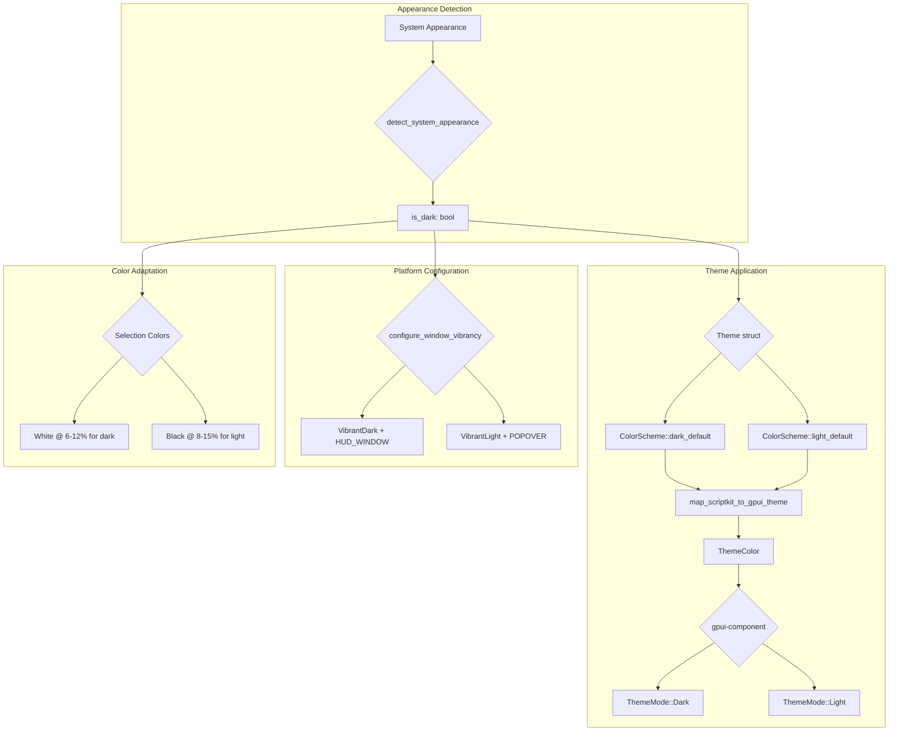

# Light Mode Theme Support for macOS System Appearance

## Overview

Add proper light mode theme support to Script Kit GPUI that automatically follows macOS system appearance. When the user's Mac is in light mode, the app should render with light colors, appropriate vibrancy settings, and correct NSVisualEffectView configuration.

## Problem Statement / Motivation

**Current behavior:**
- System appearance is detected at startup via `defaults read -g AppleInterfaceStyle`
- `ColorScheme::light_default()` exists but is rarely used effectively
- gpui-component theme mode is hardcoded to `ThemeMode::Dark` (line 184 of gpui_integration.rs)
- Vibrancy configuration (alpha=0.37, VibrantDark appearance, HUD_WINDOW material) is tuned exclusively for dark mode
- Selection/hover colors use white at low opacity—invisible on light backgrounds

**Why this matters:**
- Many macOS users prefer light mode, especially in bright environments
- System-native apps (Spotlight, Finder) follow system appearance
- Launcher apps like Raycast intentionally force dark mode to avoid this complexity—we can do better

## Proposed Solution

Implement comprehensive light mode support in three phases:

1. **Core Theme Mode Detection & Application** - Make the app correctly identify and apply light/dark mode
2. **Vibrancy Configuration** - Tune NSVisualEffectView for light mode appearance
3. **Runtime Appearance Changes** - Respond when user switches system appearance

### Architecture Diagram



## Technical Approach

### Phase 1: Core Theme Mode Detection & Application

**1.1 Add `is_dark_mode` to Theme struct**

```rust
// src/theme/types.rs

#[derive(Debug, Clone, Serialize, Deserialize)]
pub struct Theme {
    pub colors: ColorScheme,

    /// Whether this theme is for dark mode (derived from system or explicit)
    /// Default: auto-detected from system appearance
    #[serde(default = "detect_system_appearance")]
    pub is_dark_mode: bool,

    // ... existing fields
}
```

**Files:** `src/theme/types.rs:627-646`

**1.2 Update gpui-component theme mode**

```rust
// src/theme/gpui_integration.rs

pub fn sync_gpui_component_theme(cx: &mut App) {
    let sk_theme = load_theme();
    let custom_colors = map_scriptkit_to_gpui_theme(&sk_theme);

    let theme = GpuiTheme::global_mut(cx);
    theme.colors = custom_colors;

    // NEW: Use actual theme mode instead of hardcoded Dark
    theme.mode = if sk_theme.is_dark_mode {
        ThemeMode::Dark
    } else {
        ThemeMode::Light
    };

    // ... rest of function
}
```

**Files:** `src/theme/gpui_integration.rs:171-214`

**1.3 Update base theme color selection**

```rust
// src/theme/gpui_integration.rs

pub fn map_scriptkit_to_gpui_theme(sk_theme: &Theme) -> ThemeColor {
    // NEW: Start from correct base theme
    let mut theme_color = if sk_theme.is_dark_mode {
        *ThemeColor::dark()
    } else {
        *ThemeColor::light()
    };

    // ... override with Script Kit colors
}
```

**Files:** `src/theme/gpui_integration.rs:28-160`

### Phase 2: Vibrancy Configuration for Light Mode

**2.1 Add mode-aware vibrancy alpha**

```rust
// src/theme/gpui_integration.rs

let main_bg = if vibrancy_enabled {
    // Vibrancy tint alpha differs by mode:
    // - Dark mode: 0.37 (lets dark desktop show through with tint)
    // - Light mode: 0.70 (needs more opacity to maintain readability)
    let tint_alpha = if sk_theme.is_dark_mode {
        0.37  // Current tuned value for dark
    } else {
        0.70  // Higher opacity for light backgrounds
    };
    with_vibrancy(colors.background.main, tint_alpha)
} else {
    hex_to_hsla(colors.background.main)
};
```

**Files:** `src/theme/gpui_integration.rs:46-66`

**2.2 Update platform vibrancy configuration**

```rust
// src/platform.rs

/// Configure window vibrancy with appearance-aware settings
pub fn configure_main_window_vibrancy(is_dark_mode: bool) {
    unsafe {
        // Select appropriate appearance
        let appearance: id = if is_dark_mode {
            msg_send![class!(NSAppearance), appearanceNamed: NSAppearanceNameVibrantDark]
        } else {
            msg_send![class!(NSAppearance), appearanceNamed: NSAppearanceNameVibrantLight]
        };

        // Select appropriate material
        let material = if is_dark_mode {
            ns_visual_effect_material::HUD_WINDOW  // Dark, high contrast
        } else {
            ns_visual_effect_material::POPOVER    // Light, subtle blur
        };

        // ... rest of configuration
    }
}
```

**Files:** `src/platform.rs:1000-1100`

**2.3 Add light mode selection/hover colors**

```rust
// src/theme/types.rs

impl BackgroundOpacity {
    pub fn for_mode(is_dark: bool) -> Self {
        if is_dark {
            Self::default()  // Current dark mode values
        } else {
            Self {
                main: 0.70,              // Higher for light backgrounds
                title_bar: 0.80,
                search_box: 0.85,
                log_panel: 0.75,
                selected: 0.15,          // Slightly higher for visibility
                hover: 0.10,             // Slightly higher for visibility
            }
        }
    }
}

impl AccentColors {
    pub fn light_default() -> Self {
        Self {
            selected: 0x0078d4,          // Blue accent for light mode
            selected_subtle: 0x000000,   // Black for darkening effect (opposite of white)
        }
    }
}
```

**Files:** `src/theme/types.rs:60-140`, `src/theme/types.rs:295-315`

### Phase 3: Runtime Appearance Changes

**3.1 Reconfigure vibrancy on appearance change**

```rust
// src/main.rs (in appearance change handler)

cx.subscribe(&appearance_watcher, |this, _watcher, event: &AppearanceChangeEvent, window, cx| {
    info!(is_dark = event.is_dark_mode, "System appearance changed");

    // Reload theme with new appearance
    sync_gpui_component_theme(cx);

    // Reconfigure window vibrancy for new appearance
    configure_main_window_vibrancy(event.is_dark_mode);

    // Update app state
    this.update_theme(cx);
    cx.notify();
}).detach();
```

**Files:** `src/main.rs:2519-2537`

**3.2 Propagate to secondary windows**

```rust
// src/main.rs

fn handle_appearance_change(is_dark: bool, cx: &mut App) {
    // Main window
    configure_main_window_vibrancy(is_dark);

    // Notes window (if open)
    if let Some(handle) = get_notes_window_handle() {
        configure_secondary_window_vibrancy(&handle, is_dark);
    }

    // AI window (if open)
    if let Some(handle) = get_ai_window_handle() {
        configure_secondary_window_vibrancy(&handle, is_dark);
    }
}
```

**Files:** `src/main.rs`, `src/notes/window.rs`, `src/ai/window.rs`

## Acceptance Criteria

### Functional Requirements

- [ ] App detects system appearance at startup and uses appropriate theme
- [ ] gpui-component uses `ThemeMode::Light` when system is in light mode
- [ ] Window vibrancy uses `VibrantLight` appearance in light mode
- [ ] Selection/hover highlights are visible on light backgrounds
- [ ] When user switches system appearance, app updates within 2 seconds
- [ ] Secondary windows (Notes, AI) follow appearance changes
- [ ] Existing dark theme.json files continue to work unchanged

### Non-Functional Requirements

- [ ] No visual flicker during appearance transitions
- [ ] Vibrancy blur is visible and attractive in both modes
- [ ] Text remains readable at all contrast levels
- [ ] Terminal colors adapt appropriately to mode

### Quality Gates

- [ ] `cargo check && cargo clippy --all-targets -- -D warnings` passes
- [ ] `cargo test` passes (including theme_tests)
- [ ] Visual verification via screenshot tests in both modes
- [ ] Manual verification on light desktop backgrounds

## MVP Implementation

The minimum viable implementation focuses on Phase 1 and essential Phase 2 work:

### src/theme/types.rs

```rust
// Add is_dark_mode field to Theme struct
#[derive(Debug, Clone, Serialize, Deserialize)]
pub struct Theme {
    pub colors: ColorScheme,
    #[serde(default = "detect_system_appearance")]
    pub is_dark_mode: bool,
    // ... existing fields unchanged
}

// Add light mode opacity defaults
impl BackgroundOpacity {
    pub fn for_mode(is_dark: bool) -> Self {
        if is_dark {
            Self::default()
        } else {
            Self {
                main: 0.70,
                title_bar: 0.80,
                search_box: 0.85,
                log_panel: 0.75,
                selected: 0.15,
                hover: 0.10,
            }
        }
    }
}
```

### src/theme/gpui_integration.rs

```rust
pub fn map_scriptkit_to_gpui_theme(sk_theme: &Theme) -> ThemeColor {
    let colors = &sk_theme.colors;
    let opacity = sk_theme.get_opacity();
    let vibrancy_enabled = sk_theme.is_vibrancy_enabled();
    let is_dark = sk_theme.is_dark_mode;

    // Start from correct base theme
    let mut theme_color = if is_dark {
        *ThemeColor::dark()
    } else {
        *ThemeColor::light()
    };

    // Mode-aware vibrancy alpha
    let main_bg = if vibrancy_enabled {
        let tint_alpha = if is_dark { 0.37 } else { 0.70 };
        with_vibrancy(colors.background.main, tint_alpha)
    } else {
        hex_to_hsla(colors.background.main)
    };

    theme_color.background = main_bg;
    // ... rest of mappings

    theme_color
}

pub fn sync_gpui_component_theme(cx: &mut App) {
    let sk_theme = load_theme();
    let custom_colors = map_scriptkit_to_gpui_theme(&sk_theme);

    let theme = GpuiTheme::global_mut(cx);
    theme.colors = custom_colors;

    // Use correct theme mode
    theme.mode = if sk_theme.is_dark_mode {
        ThemeMode::Dark
    } else {
        ThemeMode::Light
    };

    // ... rest unchanged
}
```

### src/platform.rs

```rust
/// Configure window vibrancy with appearance-aware settings
#[cfg(target_os = "macos")]
pub fn configure_main_window_vibrancy_for_mode(is_dark_mode: bool) {
    unsafe {
        let app: id = msg_send![class!(NSApplication), sharedApplication];
        let key_window: id = msg_send![app, keyWindow];

        if key_window.is_null() {
            return;
        }

        // Select appropriate appearance
        let appearance_name = if is_dark_mode {
            NSAppearanceNameVibrantDark
        } else {
            NSAppearanceNameVibrantLight
        };

        let appearance: id = msg_send![
            class!(NSAppearance),
            appearanceNamed: appearance_name
        ];
        let _: () = msg_send![key_window, setAppearance: appearance];

        // Select appropriate material
        let material = if is_dark_mode {
            ns_visual_effect_material::HUD_WINDOW
        } else {
            ns_visual_effect_material::POPOVER
        };

        // Apply material to all visual effect views
        // ... existing traversal logic with new material value
    }
}
```

## Testing Strategy

### Automated Tests

```rust
// src/theme/theme_tests.rs

#[test]
fn test_theme_is_dark_mode_default() {
    let theme = Theme::default();
    // Should match system appearance
    let expected = detect_system_appearance();
    assert_eq!(theme.is_dark_mode, expected);
}

#[test]
fn test_light_mode_opacity_values() {
    let opacity = BackgroundOpacity::for_mode(false);
    assert!(opacity.main > 0.5, "Light mode needs higher opacity");
    assert!(opacity.selected > 0.1, "Light mode selection needs visibility");
}

#[test]
fn test_gpui_theme_mode_follows_is_dark() {
    // Mock or integration test to verify ThemeMode is set correctly
}
```

### Visual Verification Script

```ts
// tests/smoke/test-light-mode-visual.ts
import '../../scripts/kit-sdk';

await div(`
  <div class="flex flex-col gap-4 p-8 bg-white text-black">
    <h1 class="text-2xl font-bold">Light Mode Test</h1>
    <div class="p-4 bg-gray-100 rounded">Selection highlight test</div>
    <div class="p-4 bg-gray-50 rounded hover:bg-gray-200">Hover test</div>
    <button class="px-4 py-2 bg-blue-500 text-white rounded">Primary Button</button>
  </div>
`);

await new Promise(r => setTimeout(r, 1000));
const shot = await captureScreenshot();

// Save and verify
import { mkdirSync, writeFileSync } from 'fs';
import { join } from 'path';

const dir = join(process.cwd(), '.test-screenshots');
mkdirSync(dir, { recursive: true });
writeFileSync(join(dir, 'light-mode-test.png'), Buffer.from(shot.data, 'base64'));
console.error('[SCREENSHOT] Light mode visual test saved');
process.exit(0);
```

## Dependencies & Risks

### Dependencies

- gpui-component `ThemeColor::light()` must exist (verify in gpui-component crate)
- NSAppearanceNameVibrantLight must be linked in platform.rs extern block
- Existing theme.json files should continue to work (backwards compatibility)

### Risks

| Risk | Impact | Mitigation |
|------|--------|------------|
| Light vibrancy looks washed out | High | Tune alpha values iteratively; may need material testing |
| Selection invisible on light backgrounds | Medium | Use black @ low opacity instead of white |
| Appearance change causes flicker | Low | Use `cx.defer()` to batch updates |
| Breaking change for existing users | Medium | is_dark_mode defaults to system detection; existing themes unchanged |

## Future Considerations

1. **Manual appearance override** - Add `"appearance": "dark" | "light" | "system"` to config.ts
2. **Separate light/dark theme.json sections** - Allow `"light": {...}, "dark": {...}` in theme file
3. **Auto-switch based on time of day** - Schedule automatic switching
4. **Per-window appearance** - Allow different modes for main vs secondary windows

## References & Research

### Internal References

- Theme system architecture: `src/theme/types.rs:557-646`
- System appearance detection: `src/theme/types.rs:995-1034`
- gpui-component integration: `src/theme/gpui_integration.rs:28-214`
- Platform vibrancy config: `src/platform.rs:670-820`
- Vibrancy workarounds: `CLAUDE.md` §17b-17c
- Vibrancy documentation: `VIBRANCY.md`

### Related Files to Modify

| File | Changes |
|------|---------|
| `src/theme/types.rs` | Add `is_dark_mode`, light opacity defaults |
| `src/theme/gpui_integration.rs` | Mode-aware theme mapping, ThemeMode selection |
| `src/platform.rs` | VibrantLight support, mode-aware material selection |
| `src/main.rs` | Propagate appearance changes to vibrancy config |
| `src/notes/window.rs` | Handle appearance changes |
| `src/ai/window.rs` | Handle appearance changes |
| `kit-init/theme.example.json` | Add light mode example |

### External References

- NSVisualEffectView documentation: https://developer.apple.com/documentation/appkit/nsvisualeffectview
- NSAppearance documentation: https://developer.apple.com/documentation/appkit/nsappearance
- gpui-component theming: Check zed-industries/zed crate for ThemeColor patterns
